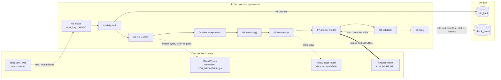

# Avvalo — Data Flow of One Check

> **Status:** Descriptive reference. Documents the code as it exists; introduces no feature and
> changes no priority.
> **Last updated:** 2026-08-29
> **Product authority:** [PRODUCT_GUIDE.md](PRODUCT_GUIDE.md)
> **Companions:** [V1_TECHNICAL_PLAN.md](V1_TECHNICAL_PLAN.md) §5 (schema, privacy),
> [AI_KNOWLEDGE_PIPELINE.md](AI_KNOWLEDGE_PIPELINE.md) (rules, minimization, model boundary),
> [PIPELINE_V2.md](PIPELINE_V2.md) (grounding contract)

The privacy invariants are stated as rules elsewhere. This document answers a different question,
the one a reviewer actually asks: **for one submitted message, where does the data physically go?**

Three claims, and the rest of the page is the evidence for them:

1. Submitted content crosses the machine boundary **exactly once** — the answer-model call.
2. Nothing content-bearing crosses the disk boundary at all.
3. The one deliberate widening of (1) is that the answer model receives submitted **names and full
   URLs**; every other protected value is tokenized first.

## 1. The flow



Three edges leave the machine, and only the thick one is unconditional:

| Edge | Carries | Default |
|---|---|---|
| `07 → answer model` | Answer-prompt view: names and URLs intact, everything else tokenized | **always** |
| `03 → Cloud Vision` | Image bytes with metadata stripped | off — `OCR_PROVIDER=rapidocr` runs PP-OCRv5 locally on ONNX |
| `06 → knowledge router` | Strict view only; the router answers with card IDs from a supplied allowlist | off — `KNOWLEDGE_ROUTER_ENABLED=false` |

No edge points at a submitted destination. A URL is never fetched, rendered, or resolved: the
domain is normalized, hashed with SHA-256, and looked up in a local table
(`app/engine/url_reputation/check.py`). Redirect resolution for shorteners
(PRODUCT_GUIDE §8.1) has no implementation.

## 2. Stage by stage

| # | Stage | Holds | Leaves the process |
|---:|---|---|---|
| 01 | Intake (`app/bot/handlers.py`, `app/web/routes.py`) | `CheckInput` with ephemeral `raw_text` / `image_bytes` / `caption`; `user_key = HMAC_SHA256(secret, id)[:32]` | — |
| 02 | Daily limit (`repo.increment_usage`) | Counter row per (user, scope, day) | — |
| 03 | QR + OCR (`_content_from_input`) | Decoded payload and OCR text, in memory | image bytes, only under `gcv` |
| 04 | Rules + reputation (`app/engine/rules`, `url_reputation`) | `RuleHit` / `Signal` objects; domain SHA-256 for local lookup | — |
| 05 | `minimize()` | Two derived views of the same text — see §3 | — |
| 06 | Knowledge (`retrieve_knowledge`) | At most three reviewed cards, selected locally | strict view, only when the router is enabled |
| 07 | Answer model (`_call_llm`) | Prompt = system + check template + rule hits + cards + answer view | **answer view** |
| 08 | Validator (`app/engine/validate.py`) | Draft and its rejection reason; one corrective retry, then `safety_fallback` | — |
| 09 | Reply (`format_result`) | Localized reply text | to the user's channel |

Language resolution and the meta-message filter sit between 03 and 04 and touch nothing external.
A status that never reached the model refunds the limit slot (`BILLABLE_STATUSES`).

## 3. The two minimized views

`minimize()` derives two views from the same ephemeral text. The difference between them is the
privacy decision, made in one line: `preserve_answer_identifiers = not content.contains_decoded_qr`
(`app/engine/pipeline.py`, `_run_stages`).

Given a submitted message:

```text
Здравствуйте! Азиз Каримов, служба безопасности банка. С вашей карты
8600 1234 5678 9012 пытаются списать деньги. Подтвердите код 4821
и перейдите по https://bit.ly/uzcard-block до 18:00.
```

**Strict view** — knowledge retrieval, the router, and *always* anything decoded from a QR code:

```text
Здравствуйте! [NAME], служба безопасности банка. С вашей карты [CARD]
пытаются списать деньги. Подтвердите код [CODE] и перейдите по
[LINK: shortened] до 18:00.
```

**Answer-prompt view** — the only text that travels over the network:

```text
Здравствуйте! Азиз Каримов, служба безопасности банка. С вашей карты [CARD]
пытаются списать деньги. Подтвердите код [CODE] и перейдите по
https://bit.ly/uzcard-block до 18:00.
```

The name and the URL survive on purpose: without them the model cannot say *which* link is
deceptive or who the sender claimed to be, and the answer degrades into the generic safety advice
PIPELINE_V2 §1 exists to prevent. Cards, codes, passwords, phones, emails, passports, addresses,
and handles are tokenized in both views. QR payloads always take the strict path, because a QR can
carry a value the user never saw as text.

Substitution is one-way and per-request. No token-to-value mapping is built, kept, or logged.

## 4. What survives the request

No table has a content column at all — the allowlist in `tests/test_schema_privacy.py` is empty,
so the build fails if one appears.

| Table | Row contents | Retention |
|---|---|---|
| `check_event` | `user_key`, timestamp, input type, language, fired rule and card IDs, status, error class, OCR confidence, latencies, tokens, cost | 90 days |
| `rate_limit` | `user_key` (a pseudonymous IP hash under `scope='web_ip'`), day, count | 48 hours |
| `feedback` | check ID, usefulness, chosen next action | 90 days |
| `consent` | `user_key`, notice version, language | 365 days |
| `deletion_log` | `user_key`, requested and completed timestamps for `/delete_my_data` | 365 days |
| `url_blocklist` | SHA-256 of a domain from a public feed — not user data | refreshed out of band |

Logging is allowlisted at both ends: `app/obs/events.py` rejects an unknown event name and an
unknown field name, and neither `log_event` nor `log_error` accepts free-form exception text — a
failure is recorded as its exception class, plus the duration for a timeout.

## 5. Where the choice actually lives

Each of these is one config value or one line, and each is a place to argue with the current
posture rather than a defect.

| # | Choice | Current | Where |
|---:|---|---|---|
| 1 | Names and full URLs reach the answer model | on, except for decoded QR content | `pipeline.py::_run_stages`, `minimize.py::minimize` |
| 2 | OCR runs locally | on — `rapidocr` on ONNX in-container | `.env.example`, `app/engine/ocr/` |
| 3 | Knowledge router is a second external call | off | `KNOWLEDGE_ROUTER_ENABLED`, `app/engine/knowledge/router.py` |
| 4 | Submitted destinations are never opened | no code path exists | `app/engine/url_reputation/check.py` |
| 5 | The limit slot commits before external work, and refunds on any non-billable status | on | `pipeline.py::run_check`, `BILLABLE_STATUSES` |
| 6 | Logs accept allowlisted fields only | on | `app/obs/events.py` |
| 7 | Web identity is a signed random cookie ID through the same HMAC; the client IP is hashed separately for the per-IP guard | on | `app/web/session.py`, `app/web/abuse.py` |

Changing 1, 2, or 3 changes what leaves the machine. Changing 4 would need a founder decision
recorded in PRODUCT_GUIDE §8.1 before any code.
